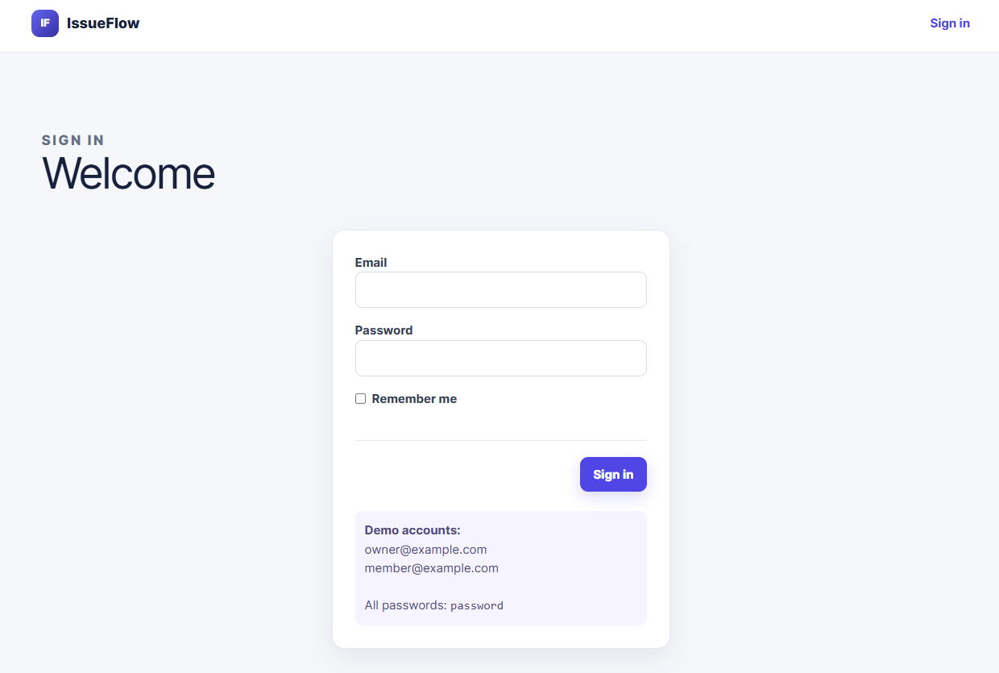
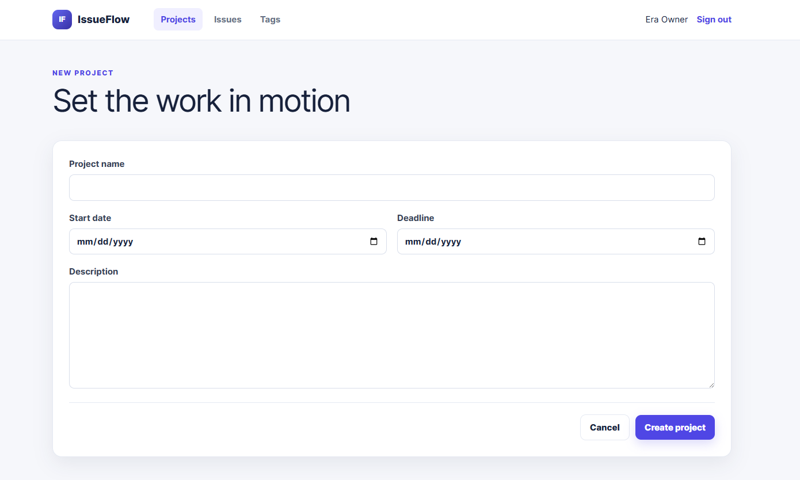
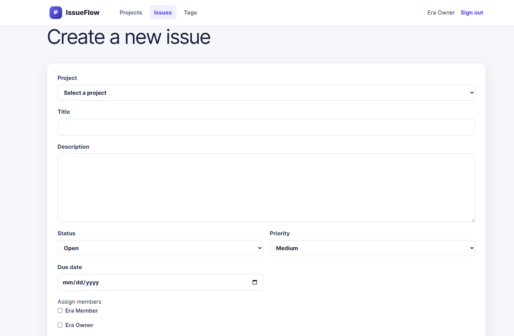
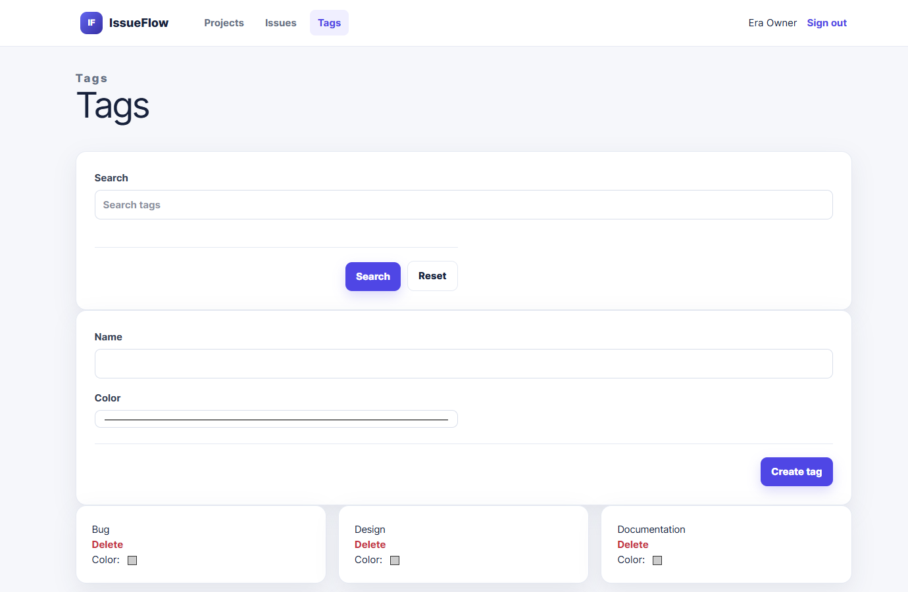
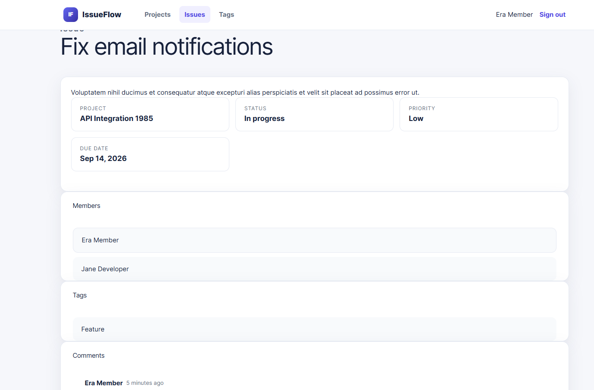

# Mini Issue Tracker (IssueFlow)

A role-based issue tracking system built with Laravel 11. Track projects, manage issues, assign team members, and control access with owner and member roles.

## Requirements

- PHP 8.5+
- Composer
- Node.js 18+
- Git

## Setup

```bash
# Clone the project
git clone <repository-url>
cd issue-tracker

# Install dependencies
composer install
npm install

# Create and configure environment
cp .env.example .env
php artisan key:generate

# Setup database
php artisan migrate:fresh --seed

# Build assets
npm run build

# Start development server
php artisan serve
```

Visit `http://127.0.0.1:8000`

## Demo Credentials

**Owner Account**
- Email: owner@example.com
- Password: password

**Member Account**
- Email: member@example.com
- Password: password

## Screenshots

### Sign In


### Create Project


### Create Issue


### Tags Management


### Issue Details


## Features

- Create and manage projects (owners only)
- Create and track issues with status, priority, and tags
- Assign team members to issues
- Add comments to issues
- Members can view assigned projects and comment only
- Owners can manage all resources
- SQLite database with persistent storage

## Testing

```bash
php artisan test
```

## Commands

| Command | Purpose |
|---------|---------|
| `php artisan serve` | Start dev server |
| `php artisan migrate:fresh --seed` | Reset database |
| `php artisan test` | Run tests |
| `npm run dev` | Watch assets |
| `npm run build` | Build assets |
